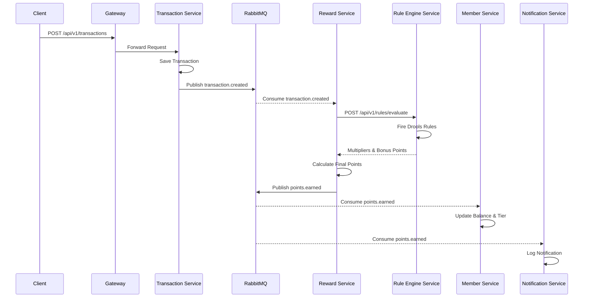
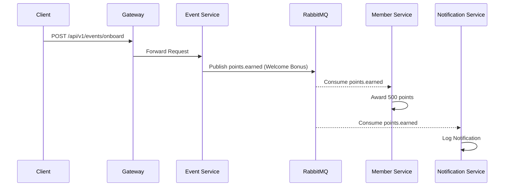

# Loyalty Management System (LMS) Documentation

## 1. System Overview
The Loyalty Management System (LMS) is a distributed platform designed to automate customer engagement through rewards. It enables businesses to define flexible loyalty rules, track customer transactions, and award points/discounts based on real-time behavior.

## 2. Architecture
The system follows a microservices architecture, leveraging event-driven communication for scalability and decoupling.

### Technology Stack
- **Framework**: Spring Boot 3.4.1
- **Language**: Java 21
- **Messaging**: RabbitMQ (Topic & Direct Exchanges)
- **Database**: PostgreSQL 15 (Relational storage)
- **Caching**: Redis 7
- **Rule Engine**: JBoss Drools 8.x
- **API Management**: Spring Cloud Gateway

---

## 3. Microservice Roles

| Service | Port | Primary Responsibility |
| :--- | :--- | :--- |
| **API Gateway** | 8080 | Routing, load balancing, and central API entry point. |
| **Member Service** | 8081 | Lifecycle of members, tiers, and point balance management. |
| **Transaction Service** | 8082 | Recording sales and publishing transactional events. |
| **Rule Engine** | 8083 | Evaluating complex DRL rules against transaction facts. |
| **Reward Service** | 8084 | Orchestrating reward logic and multiplier calculations. |
| **Event Service** | 8085 | Triggering manual or systemic events like Onboarding/Referrals. |
| **Notification Service** | 8086 | Consumer-only service for user communication (logs/emails). |

---

## 4. Key Features & Flows

### A. Core Transaction and Reward Flow
This is the primary flow of the system, triggered by a customer purchase.



### B. Manual & Systemic Events (Onboarding/Referrals)
Triggered by direct API calls to the **Event Service**, bypassing transaction evaluation.



### C. Business Rule Management
Admins can dynamically add or update loyalty rules without restarting the system.

- **Storage**: Rules are stored in the `rules` table in PostgreSQL with DRL (Drools Rule Language) content.
- **Dynamic Loading**: The `RuleEngineService` rebuilds its `KieContainer` whenever rules are updated, ensuring immediate application.
- **Example Rule**:
  ```drl
  rule "Platinum Bonus"
  when
    $f: TransactionFact(memberTier == "PLATINUM")
  then
    $f.setPointMultiplier(2.0);
    $f.setBonusPoints(100);
  end
  ```

---

## 5. API Reference (Core Endpoints)

### Member Management
- `POST /api/v1/members`: Register a new member.
- `GET /api/v1/members/{id}`: Fetch member details.
- `GET /api/v1/members/{id}/points`: Get current point balance.

### Transactions
- `POST /api/v1/transactions`: Record a new transaction.
- `GET /api/v1/transactions/summary/{memberId}`: Get spending summary for a member.

### Rule Management
- `POST /api/v1/rules`: Create a new Drools rule.
- `GET /api/v1/rules`: List all active rules.

### Special Events
- `POST /api/v1/events/onboard`: Trigger onboarding rewards.
- `POST /api/v1/events/referral`: Trigger referral rewards.

---

## 6. Messaging Architecture (RabbitMQ)

- **Exchange**: `transaction.exchange` (Topic)
- **Queues**:
    - `transaction.created.queue`: Bound to `transaction.created`. Consumed by **Reward Service**.
    - `points.earned.queue`: Consumed by **Member Service** and **Notification Service**.
- **Serialization**: JSON (Jackson) for all payloads.
